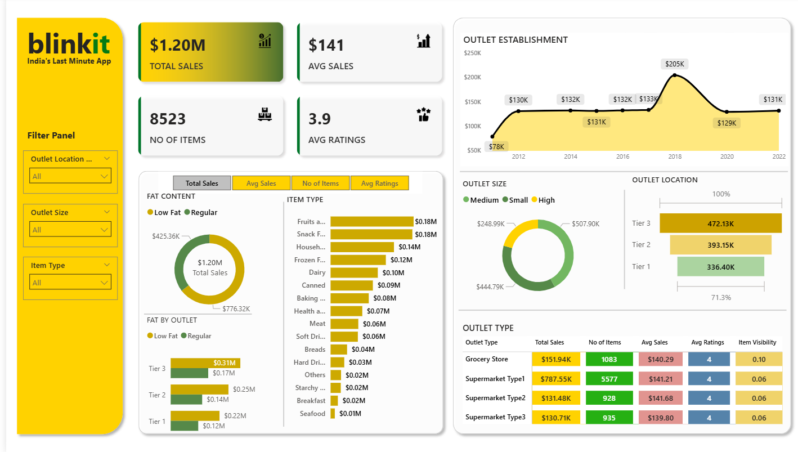

# Blinkit Quick Commerce Power BI Dashboard

## 📌 Project Objective
To analyze Blinkit-style grocery data and build an interactive dashboard to monitor
sales trends, outlet performance, inventory risk and customer behavior.

## 🛠 Tools Used
Power BI, DAX, Power Query, Excel

## 📊 KPIs
- Total Sales
- Avg Sales
- Avg Ratings
- Outlet-wise Performance
- Product Category Demand

## 📷 Dashboard Preview

## 💡 Key Insights
- Tier 3 outlets generated the highest revenue.
- Fruits & Snacks were top-selling categories.
- Supermarket Type1 had highest average sales.
